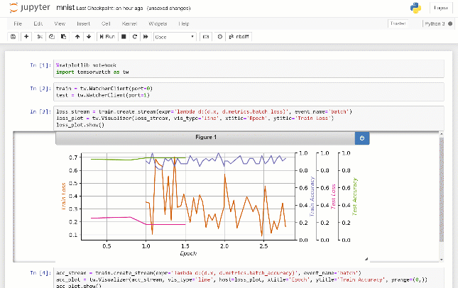

# Welcome to TensorWatch

TensorWatch is a debugging and visualization tool designed for deep learning and reinforcement learning. It fully leverages Jupyter Notebook to show real time visualizations and offers unique capabilities to query the live training process without having to sprinkle logging statements. We also hope to build on several other libraries to allow performing debugging activities such as model graph visualization, model statistics, prediction explanations etc.

TensorWatch is under heavy active development with a goal of providing a research platform for debugging machine learning in one easy to use, extensible and highly hackable package.



## How to Get It

```
pip install tensorwatch
```

TensorWatch supports Python 3.x and is tested with PyTorch 0.4-1.x. Most features should also work with TensorFlow eager tensors.

## How to Use It

### Quick Start

Here's simple code that logs some metric every second:
```
import tensorwatch as tw
import time

w = tw.Watcher(filename='test.log')
s = w.create_stream(name='my_metric')
w.make_notebook()

for i in range(1000):
    s.write((i, i*i)) 
    time.sleep(1)
```
When you run this code you will notice a Jupyter Notebook file `test.ipynb` gets created in your script folder. From command prompt type `jupyter notebook` and click on `test.ipynb`. Click on Run button to see live line graph as values gets written in your script.

### Visualizations
In above example, the line graph is used as default visualization. However TensorWatch supports many other visualizations including histogram, pie charts, scatter charts, bar charts and 3D versions of many of these plots. You can simply log your data, specify the chart type you had like to visualize and let TensorWatch take care of the rest.

[Learn more](docs/visualizations.md)

### Training within Jupyter Notebook
Many times you might prefer to do training and testing from within Jupyter Notebook instead of from a separate script using frameworks such as [fast.ai](https://www.fast.ai/). TensorWatch can help you do sophisticated visualizations effortlesly for your code running within Jupyter Notebook.

[Learn more](docs/nb_train.md)

### Querieng the Process (Lazzy Log Mode)
One of the unique capability TensorWatch offers is to be able to query the live running training process, retrieve the result of this query as stream and direct this stream to your preferred visualization - all of these without explicitly logging any data before hand! We call this new way of debugging *lazzy logging mode*.

[Learn more](docs/lazzy_logging.md)

### Model and Data Exploration
You can explore your model graph from within Jupyter Notebook (built on [hiddenlayer](https://github.com/waleedka/hiddenlayer) library):


You can also view your dataset in lower dimensional space using techniques such as T-SNE and explore using 3D interface from within Jupyter Notebook:


You can also use TensorWatch to see various metrics for different layers of your model from the comfort of Jupyter Notebook (built on [torchstat](https://github.com/Swall0w/torchstat) library):

### Prediction Explanations
We aim to provide various tools for explaining predictions over time to help debugging models. Currenly we offer several explainers for convolutional networks including Lime (built on [Visual Attribution](https://github.com/yulongwang12/visual-attribution) library):

## Tutorials

- [Debugging with TensorWatch: A 15 Minutes Blitz](docs/tutorial.md)

## Participate

### Papers

More technical details are available in [TensorWatch paper (FSR 2017 Conference)](https://arxiv.org/abs/1705.05065). Please cite this as:
```
@inproceedings{TensorWatch2019eics,

}
```

### Contribute

Please take a look at [open issues](https://github.com/microsoft/TensorWatch/issues) if you are looking for areas to contribute to.

* [More on TensorWatch design](docs/design)
* [Contribution Guidelines](CONTRIBUTING.md)

## Contact

Join the TensorWatch group on [Facebook](https://www.facebook.com/groups/378075159472803/) to stay up to date or ask any questions.

## FAQ

If you run into problems, check the [FAQ](docs/faq) and feel free to [post issues](https://github.com/Microsoft/TensorWatch/issues) in the  TensorWatch repository.

## License

This project is released under the MIT License. Please review the [License file](LICENSE.txt) for more details.
